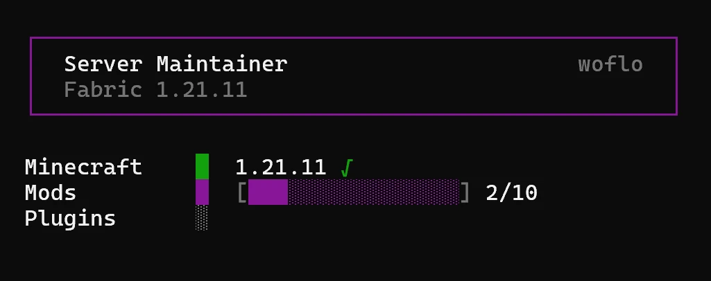
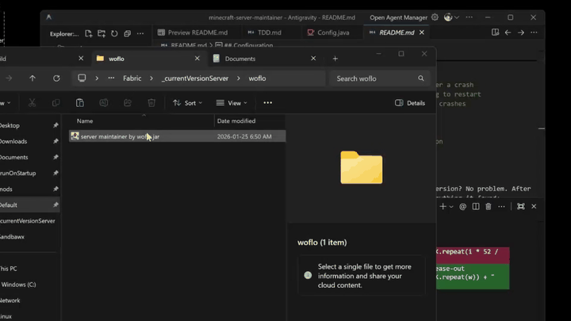

<h1 align="center">Server Maintainer, by woflo</h1>

<p align="center">
  <b>Let your server take care of itself</b><br>
  Updates Minecraft, mods, plugins, and datapacks automatically so you don't have to.
</p>

<p align="center">
  
  
  
  
</p>

<p align="center">
  
  
  
  
  
</p>

<p align="center">
  
</p>

## What It Does

**Replace your `run.bat` with this.** Double-click once and your server handles the rest, checking for updates, installing them safely, and keeping everything running smoothly.

Before any Minecraft update, it creates a backup. After updating, it makes sure your server still starts. If something goes wrong, it automatically rolls back to the working version.

## Quick Start

**What you need:** Java 21+ and an existing Minecraft server

**Getting started is simple:**

1. Put `server maintainer by woflo.jar` in your server folder
2. Double-click it

That's it. The first run creates a config file at `woflo/config.yml`. From then on, it just works.

## Features

| Feature | Description |
|---------|-------------|
| Auto-updates | Minecraft, mod loaders, mods, plugins, datapacks |
| Smart updates | Only updates Minecraft when enough mods support it |
| Backups | Created before Minecraft updates, cleaned after 7 days |
| Verification | Tests startup after updates, rolls back if needed |
| Crash recovery | Restarts on crash with rate limiting |
| Dry run | Preview changes with `-d` |

## Usage

```
java -jar "server maintainer by woflo.jar" [options]
```

| Option | Description |
|--------|-------------|
| `-d, --dry-run` | Preview changes without applying |
| `-u, --update-only` | Update only, don't start server |
| `-r, --rollback` | Restore most recent backup |
| `-i, --interactive` | Prompt before updates |
| `-y, --yes` | Skip all prompts |
| `-h, --help` | Show help |

## Configuration

The first time you run it, Server Maintainer creates a config file at `woflo/config.yml`. This is where you can customize how everything works. Here's what each setting does:

```yaml
memory:
  min: 2G    # Minimum RAM for your server
  max: 6G    # Maximum RAM for your server

updates:
  minecraft: true         # Update Minecraft and your mod loader
  mods: true              # Update mods from Modrinth
  plugins: true           # Update plugins from Modrinth  
  datapacks: false        # Update datapacks from Modrinth
  min-compatibility: 60   # Only update Minecraft when this % of your mods support the new version
  allow-snapshots: false  # Include Minecraft snapshot versions
  allow-beta: false       # Include beta versions of mods/plugins

startup-timeout: 90       # How many seconds to wait for your server to start
interactive: false        # Ask before updating (set to true to enable prompts)

# Crash recovery settings
restart-delay: 5          # Seconds to wait before restarting after a crash
max-crashes: 3            # How many crashes before we stop trying to restart
crash-window: 300         # Time window (in seconds) for counting crashes

# Optional settings you can add:
# target-version: 1.21.0  # Lock to a specific Minecraft version
# server-jar: server.jar  # Override automatic server jar detection
```

## Skipping Updates

Want to keep a specific mod, plugin, or datapack at its current version? No problem. After your first run, Server Maintainer creates a text file listing everything it found:

- Mods: `mods/mods.txt`
- Plugins: `plugins/plugins.txt`  
- Datapacks: `datapacks/datapacks.txt`

Just add a `#` in front of any filename you want to skip:

```
# sodium-0.5.8.jar    # This won't be updated
lithium-0.12.1.jar    # This will be updated
```

Works the same way for all three types.

## Backups

Before any Minecraft update, Server Maintainer creates a full backup of your server. These live in `woflo/backups/` with names like `20250125-143022_mc` (that's year-month-day-hour-minute-second, so you can always find the one you need).

Backups automatically clean themselves up after 7 days, so you don't have to worry about them piling up.

Need to roll back? Just run with `--rollback` and you'll be back to your most recent backup in seconds.

## How It Works

<p align="center">
  
</p>

Here's what happens behind the scenes every time you run Server Maintainer:

```
┌─────────────────┐
│  Detect Setup   │  Find mod loader, current versions
└────────┬────────┘
         ▼
┌─────────────────┐
│  Check Updates  │  Query Mojang API, Modrinth
└────────┬────────┘
         ▼
┌─────────────────┐
│  Apply Updates  │  Backup (if MC update), download, install
└────────┬────────┘
         ▼
┌─────────────────┐
│  Verify Start   │  Test server boots, rollback if needed
└────────┬────────┘
         ▼
┌─────────────────┐
│  Run Server     │  With crash recovery
└─────────────────┘
```

## License

[GPL-3.0](LICENSE)
